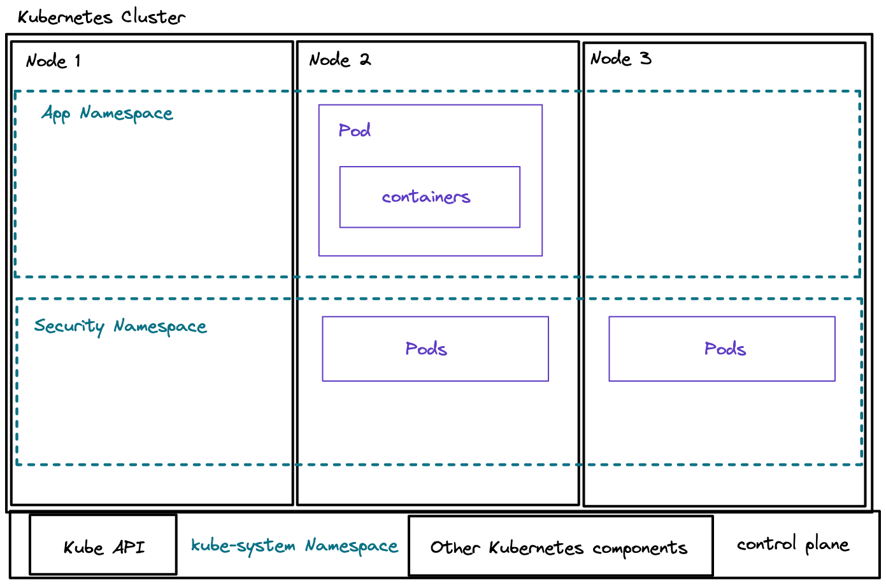

# Scenario One: Setting up a Kubernetes demo environment & learning about kubectl

To talk about what a Kubernetes cluster is, it helps to first have a Kubernetes cluster set up that you can look at an explore yourself.

In this example, we are going to set-up a one node kind cluster. Kind stands for Kubernetes in Docker; which will basically run the Kubernetes components inside of a docker container.
However, don't let this irritate you.

### Prerequisites

Make sure to have
* Access to Docker -- this includes the Docker Engine and access to Docker in the CLI.

```
❯ docker --version
Docker version 20.10.14, build a224086
```

You can find the installation instructions on the [following page.](https://docs.docker.com/get-docker/)

## Installing KinD to your terminal

In this example, I will assume that you have access to [Homebrew](https://brew.sh/) to install KinD.
You can find alternative installation instructions on the [KinD documentation.](https://kind.sigs.k8s.io/docs/user/quick-start/#installation)

Check if you have Homebrew installed by running the following command in your terminal:
```
brew --version
```

**Contributing**
I am running this example on a MacBook & will add further examples with specifications in the future. If you have another envrionment and would like to showcase how to install and use KinD on Linux or Windows, please create a PR. 

Run the following command in your Terminal to install KinD:
```
brew install kind
```

Verify that you have KinD installed:
```
❯ kind version
kind v0.11.1 go1.17.2 darwin/arm64
```

## Creating a Kubernetes cluster

It is pretty streaight forward to create a simple, one node Kubernetes cluster once you have KinD installed.
At the moment, don't worry about 1 node versus multiple node clusters, we will look at that in a bit.

To understand how to create a cluster with KinD, we first have to explore the CLI tool or the documentation.
This can be done by running the following command in your terminal:
```
❯ kind --help
kind creates and manages local Kubernetes clusters using Docker container 'nodes'

Usage:
  kind [command]

Available Commands:
  build       Build one of [node-image]
  completion  Output shell completion code for the specified shell (bash, zsh or fish)
  create      Creates one of [cluster]
  delete      Deletes one of [cluster]
  export      Exports one of [kubeconfig, logs]
  get         Gets one of [clusters, nodes, kubeconfig]
  help        Help about any command
  load        Loads images into nodes
  version     Prints the kind CLI version

Flags:
  -h, --help              help for kind
      --loglevel string   DEPRECATED: see -v instead
  -q, --quiet             silence all stderr output
  -v, --verbosity int32   info log verbosity
      --version           version for kind

Use "kind [command] --help" for more information about a command.
```

Across the DevOps and cloud native space, people are using lots and lots of different CLI, terminal-based tools; and let me tell you, most people don't know by default how to use them.
To understand what commands you have to give a tool, you will look at the `--help` instructions or the Documentation of the tool.

Next, we want to learn how to create a cluster with the `create command` that we saw in the earlier command output. The following command will provide us with further details on how to use the KinD CLI:
```
❯ kind create --help

Creates one of local Kubernetes cluster (cluster)

Usage:
  kind create [flags]
  kind create [command]

Available Commands:
  cluster     Creates a local Kubernetes cluster

Flags:
  -h, --help   help for create

Global Flags:
      --loglevel string   DEPRECATED: see -v instead
  -q, --quiet             silence all stderr output
  -v, --verbosity int32   info log verbosity

Use "kind create [command] --help" for more information about a command.
```

And lastly, we want to see if we can pass any other information into our KinD cluster:
```
❯ kind create cluster --help

Creates a local Kubernetes cluster using Docker container 'nodes'

Usage:
  kind create cluster [flags]

Flags:
      --config string       path to a kind config file
  -h, --help                help for cluster
      --image string        node docker image to use for booting the cluster
      --kubeconfig string   sets kubeconfig path instead of $KUBECONFIG or $HOME/.kube/config
      --name string         cluster name, overrides KIND_CLUSTER_NAME, config (default kind)
      --retain              retain nodes for debugging when cluster creation fails
      --wait duration       wait for control plane node to be ready (default 0s)

Global Flags:
      --loglevel string   DEPRECATED: see -v instead
  -q, --quiet             silence all stderr output
  -v, --verbosity int32   info log verbosity
```

So here we are, now we can put together the command to create a KinD Kubernetes cluster, named test:
```
❯ kind create cluster --name test
Creating cluster "test" ...
 ✓ Ensuring node image (kindest/node:v1.21.1) 🖼 
 ✓ Preparing nodes 📦  
 ✓ Writing configuration 📜 
 ✓ Starting control-plane 🕹️ 
 ✓ Installing CNI 🔌 
 ✓ Installing StorageClass 💾 
Set kubectl context to "kind-test"
You can now use your cluster with:

kubectl cluster-info --context kind-test

Thanks for using kind! 😊
```
Note: Make sure that the Docker Daemon is running when you are running the commands.

## Getting started with kubectl

kubectl is the CLI tool that everyone uses to interact with your Kubernetes resources. I would highly recommend to get started with kubectl before using other tools to access your Kubernetes cluster since this will allow you to better understand the resources of your cluster before adding layers of abstraction.

### Installing kubectl to your terminal

Please follow the instructions provided by the official Kubernetes documentation: https://kubernetes.io/docs/tasks/tools/#kubectl
You will find different installation guides for different operating systems.

Once you completed one of the guides, make sure to verify your installation by running the following command in your terminal:
```
kubectl version
```

### Understanding the kubeconfig file

We now have a local one-node KinD Kubernetes cluster running. However, we have to connect to this cluster via the kubectl CLI tool.

Upon creating a Kubernetes cluster with KinD, the access information are automatically saved in a `kubeconfig` file.
This kubeconfig file is generally saved at the following location of your computers:  `~/.kube/config`

You can find the file through the following command:
```
cat ~/.kube/config
```

Note: be careful to not show anyone your credentials or deleting your kubeconfig.

### Getting started with kubectl

In this section, we will show you several different commands to use with kubectl. I would suggest you to play around with the tool beyond this guide. A lot from it comes by googling `how to do x` and then trying it out yourself.

You can find multiple cheat-sheets online with kubectl commands, such as [this one.](https://kubernetes.io/docs/reference/kubectl/cheatsheet/)

#### Querying cluster resources

Like mentioned earlier, a Kubernetes cluster is made up of one or several nodes. These nodes are logical compute engines. I don't want to say that the Kubernetes nodes will match physical hardware since this is mostly not the case. They are basically logical compute divisions. One node is basically a Virtual Machine. Now this Virtual Machine will run the Kubernetes componentes that are needed to bring you the magic of Kubernetes. 

Here is an overview of how our cluster might look like:

We have in this case a three-node Kubernetes cluster, the cluster has two namespaces onto which we deploy our workloads. Note that we communicate with our cluster through the Kubernetes API which is part of the components installed in our Kubernetes main node. Lots of the Kubernetes-specific resources needed to run our Kubernetes cluster are in the kube-system namespace:



**Nodes**
So here is our first kubectl command, we are going to look up the number of nodes that are part of our Kubernetes cluster:
```
❯ kubectl get nodes

NAME                 STATUS     ROLES                  AGE   VERSION
test-control-plane   NotReady   control-plane,master   73s   v1.21.1
```

This will tell you the name of the node, the status i.e. whether you can alreadys chedule workloads onto the cluster, what type of node it is and the version of Kubernetes that is deployed on the node.

As you can see, our cluster is `NotReady` yet. Meaning, we have to wait to see when it does get ready and then we can move onto the next command.

**Namespaces**

The next part we should learn about are namespaces. When we interact with Kubernetes clusters, 80% of the time, we are not interested in where our workloads are running, i.e. on which nodes our workloads are deployed. Ideally, we should perceive our Kubernets cluster as one system, even if it is comprised out of multiple nodes. 

However, to bring some organisation into our cluster, to divide our cluster into separate parts, we can use namespaces. Namespaces provide a logical division inside of our cluster, it does not provide physical division. Usually, you would put similar types of workloads into the same namespace. An example would be to put all of the workloads and resources related to your frontend application into the frontend namespace. 

```
❯ kubectl get namespaces
NAME                 STATUS   AGE
default              Active   4m18s
kube-node-lease      Active   4m19s
kube-public          Active   4m19s
kube-system          Active   4m19s
local-path-storage   Active   3m54s
```

These namespaces are listed inside of your Kubernetes cluster by default. Depending on the type of Kubernetes cluster you have e.g. is it a managed cluster by one of the cloud providers or a local cluster and similar. 
Generally, you should expect to have a default namespace and the kube-... namespaces. The kube-... namespaces will run the Kubernetes components. The default namespace should generally not be used.

**Request all resources**
We can then go ahead and look into one of the namespaces. This can be done by requesting all of the resources that are listed within the namespace:
```
kubectl get all -n kube-system
```

Once you run the command, we can already see lots of resources that live in this namespace. In the next scenarios we are going to learn in detail about some of the most common resources that are used in Kubernetes.

By now, you might have identified a pattern within kubectl commands. The structure for writing a kubectl command is:
```
kubectl <what do you want to do> <any flags or other commands you want to pass in> <the resources you would like to query> <flags can also be provided here>
```

## Cleaning up your environment 

We will use the Kubernetes cluster that we created in this section for the future scenarios. However, you should not leave it running in the backgroudnd.

Until you are trying out one of the other scenarios, I suggest you to either of the following:
1. Stop Docker and with that you will stop the container that KinD uses to run the Kubernetes cluster
2. To delete the Kubernetes cluster 

**Deleting the KinD cluster**

Run the following command in your terminal to delete your KinD cluster:
```
kind delete cluster --name test
```